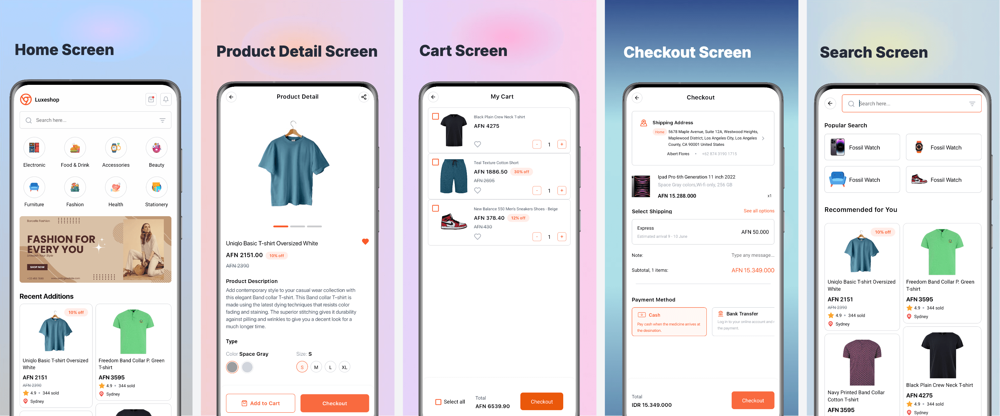

# E-commerce App UI

This e-commerce project is built on top of Expo, TypeScript, NativeWind and Redux. The project is a UI but have used redux for the sake of adding products to the cart page.

## Demo

<video width="320" height="240" autoplay controls>
  <source src="./screenshots/luxeshop-demo.mp4" type="video/mp4">
</video>

## Documentation

Read more about the tools used in this project.

[Expo Documentation](https://docs.expo.dev/)

[Nativewind Documentation](https://www.nativewind.dev/)

## Sections

- Homepage
- Product Detail Page
- Cart Page
- Checkout Page
- Search Page

## License

[MIT](https://choosealicense.com/licenses/mit/)

## Run Locally

Clone the project

```bash
  git clone https://github.com/maisamaf/luxeshop
```

Go to the project directory

```bash
  cd luxeshop
```

Install dependencies

```bash
  npm install
```

Start the server

```bash
  npx expo start
```

## Screenshots


